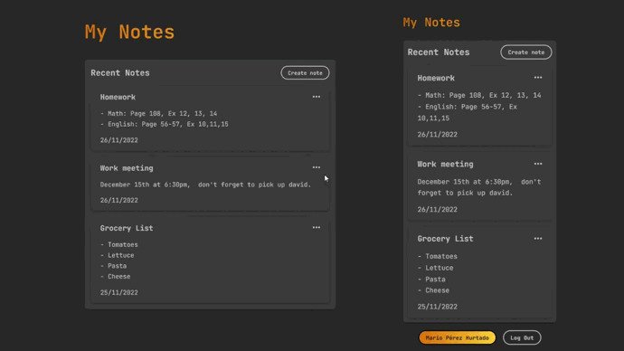

## Cloud Notes ☁️✏️

Cloud Notes App - React ⚛️ & Firebase 🔥

Store your notes in the cloud instantly between all your devices

This project uses BaaS (Firebase), to use authentication & database in React.

## Getting Started

Clone this repository:

<pre><code>git clone https://github.com/marioperezhurtado/react-firestore.git</code></pre>

Move to new directory:

<pre><code>cd react-firestore/</code></pre>

Install all dependencies:

<pre><code>npm install</code></pre>

Register and setup your Firebase App

[Firebase Docs](https://firebase.google.com/docs/web/setup)

## Usage

Launch a development server:

<pre><code>npm run dev</code></pre>

Build for production:

<pre><code>npm run build</code></pre>
